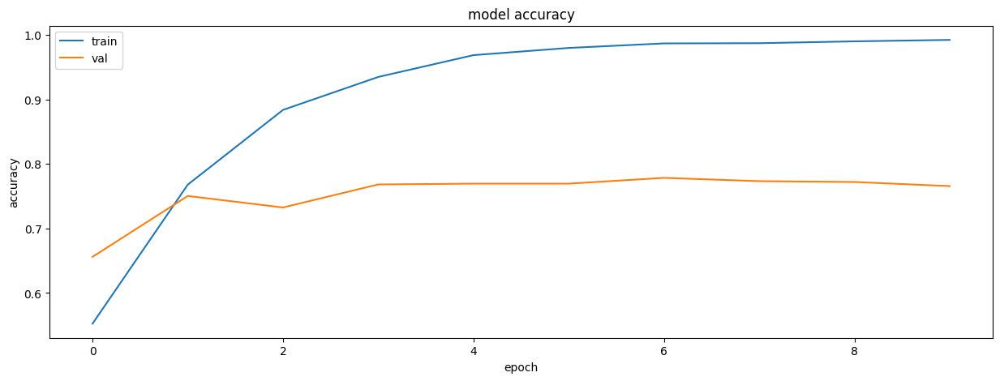

# indabaX-Swahili-Sentiment-Classifier

This project focuses on sentiment classification, which involves predicting the sentiment or emotion associated with a given text. The goal is to train a machine learning model to accurately classify text into positive, negative, or neutral sentiments.

## Project Overview

The sentiment classification project consists of the following major steps:

1. **Data Preprocessing:**
   - Loading and inspecting the dataset
   - Cleaning the text by removing special characters, punctuation, URLs, and HTML tags
   - Tokenizing the text and converting it to sequences
   - Padding the sequences to ensure uniform length
   - Splitting the dataset into training and testing sets
   - One-hot encoding the sentiment labels

2. **Model Creation:**
   - Designing and building a deep learning model using a sequential architecture
   - Adding layers such as embedding, LSTM, and dense layers to the model
   - Compiling the model with appropriate loss function, optimizer, and metrics

3. **Model Training:**
   - Training the model on the preprocessed training data
   - Monitoring the training progress and optimizing hyperparameters
   - Evaluating the model's performance on the validation set, if applicable

4. **Model Evaluation:**
   - Evaluating the model's performance on the testing set
   - Calculating relevant evaluation metrics such as accuracy, precision, recall, and F1-score
   - Analyzing the results and gaining insights into the model's strengths and weaknesses


## Usage

To use this project:

1. Clone the repository:

```bash
    git clone https://github.com/your-username/sentiment-classification-project.git
```

2. Install the required dependencies:

```bash
    pip install -r requirements.txt
```

3. Run the preprocessing script to clean and preprocess the text data:

```bash
    python preprocessing.py
```

4. Run the training script to train the sentiment classification model:

```bash
    python train.py
```

Model training accuracy for the current model using Neural Tech Swahili Dataset is 74%. Compared to other models trained with IndabaX dataset that's about 48% - 50% accurate



5. Perform sentiment classification inference:

```bash
    python inference.py "Text for sentiment classification"
```

Replace `"Text for sentiment classification"` with the actual text you want to classify.

6. View the predicted sentiment:

The script will display the input text and the predicted sentiment label.

## Saved Model and Tokenizer

The trained model and tokenizer files need to be saved in the specified locations for sentiment classification inference using the command-line interface (CLI). Make sure the following files are present in the respective directories:

- Model: `model/hyper_sarufi_tunned_swahili_sentiment_rating.h5`
- Tokenizer: `tokenizers/hyper_sarufi_tunned_swahili_sentiment_rating.json`

Note: Adjust the file paths as per your directory structure.

## License

This project is licensed under the [MIT License](LICENSE).

## Acknowledgments

- The sentiment classification project was inspired by indabaX sentiment classification challenge from Zindi.
- Special thanks to Neural Tech for their Swahili sentiment dataset dataset.

## Contributors

- [Edgar Gulay](https://eddiegulay.me)
